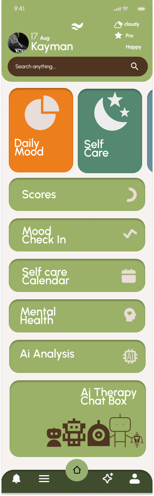
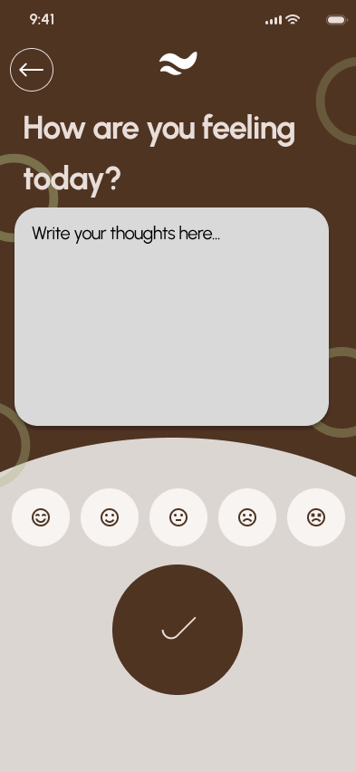
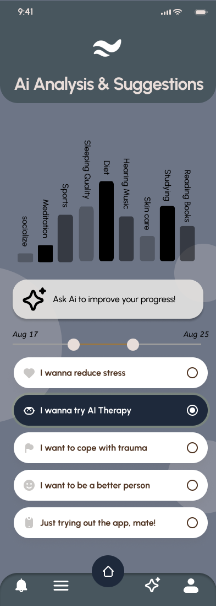

# MentalHealthCapyBara
MindMate - A student mental health companion app that provides mood tracking, self-care tools, and smart calendar reminders to help students manage stress and improve mental well-being.

# 🌱 MindMate - Student Mental Health Companion

MindMate is a student-focused mental health companion app designed to help university students track their emotions, practice self-care, and manage stress proactively.

---

## 🚀 About the Project

University students face increasing mental health challenges such as stress, anxiety, and depression. Counseling services are often limited, and stigma prevents many from seeking help.  
MindMate bridges this gap by providing an **accessible, stigma-free, and proactive tool** that supports students in their daily life.

---

## ✨ Features

- **Mood Check-in** – Quick, emoji-based mood logging in seconds  
- **Mood History** – Visual trends to spot patterns in emotional well-being  
- **Self-Care Calendar** – Syncs with deadlines/exams and sends timely nudges  
- **AI Chat & Suggestions** – Guided breathing, motivational tips, and personalized self-care recommendations  

---

## 🖼️ Prototype

🔗 **[View Figma Prototype](https://www.figma.com/design/PHysuZVW14C1B9nXgMzCs1/MentalHealthCapyBara?node-id=0-1&t=lUvevv7y1X8lvyP3-1)**  
> Click the link above to explore the interactive prototype.

---

## 🏗️ Tech Stack

- **Frontend:** [Flutter](https://flutter.dev/)  
- **Backend:** [Firebase](https://firebase.google.com/) (Auth, Firestore, Notifications)  
- **APIs:** 
  - [Google Calendar API](https://developers.google.com/calendar)
  - [OpenAI API](https://platform.openai.com/)  

---
## 📸 Screenshots

| Welcome Screen | Mood Check-in | Mood History |
|---------------|---------------|-------------|
|  |  |  |

_Add screenshots of your Figma screens into a `/docs` folder and link them here._

---

## 📚 Future Scope

- University counseling service integration  
- Peer-to-peer anonymous support community  
- Multilingual support & crisis hotline integration  

---

## 👨‍💻 Team

**Team CapyBaraDevs**  

---

## 📝 License

This project is licensed under the [MIT License](LICENSE).
